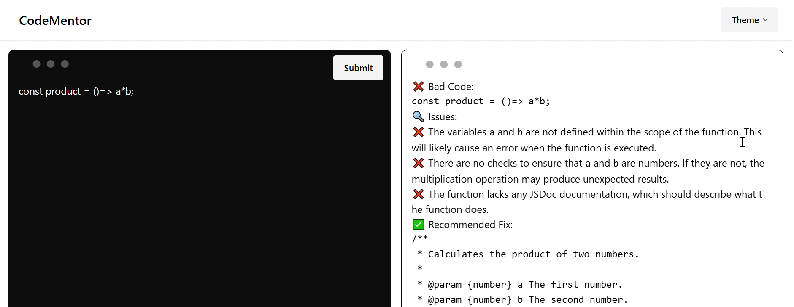

# 🧑‍💻 AI Code Reviewer 🤖

Welcome to **AI Code Reviewer** 🚀! This is a React-based web app that acts as a code reviewer using the **Gemini Flash 2.0 model** 🧠! You can paste or write your code, and it will be thoroughly reviewed for errors ❌, improvements 🔧, and development best practices 🌟.



## 🚀 Features

- **AI-powered code review**: Powered by **Gemini Flash 2.0** 💡, this app reviews your code like a professional developer. It catches errors 🛠️ and suggests improvements to make your code better. 🤖
- **Supports all languages** 🌍: Thanks to the power of **Gemini**, this code reviewer supports a wide variety of programming languages 🧑‍💻. No matter what language you're using, Gemini has your back!

- **Customizable themes** 🎨: Choose from **all DaisyUI themes** 🌈 to style the editor to your liking. Whether you're into dark mode 🌙, light mode 🌞, or something funky like **Cyberpunk** 🤖✨—you name it!

- **Theme persistence** 💾: Your theme preference is saved in **local storage** 🔒, ensuring that even after you reload, your selected theme stays as is.

- **Modern UI** 🖥️: Using **Tailwind CSS** for smooth styling and a minimalistic, responsive design. 🌟

- **Code highlighting** ✨: With **PrismJS**, your code will be highlighted beautifully for readability 📚.

- **Markdown support** 📝: Add context to your code or explanation with **React Markdown**! Display markdown content seamlessly. 💬

## 🛠️ Tech Stack

- **ReactJS** ⚛️: A powerful front-end library for building user interfaces.
- **Gemini Flash 2.0** 🤖: The AI model that reviews your code and provides insights.
- **DaisyUI** 🌼: Beautiful, customizable themes for the user interface.
- **TailwindCSS** 🪄: Utility-first CSS framework for responsive and flexible layouts.
- **PrismJS** 🔍: Syntax highlighting for your code snippets.
- **React Markdown** 📜: Render markdown content within your React components.
- **react-simple-code-editor** ✍️: The code editor used to write or paste your code.

## 🧑‍💻 How to Use

1. Clone the repository 📦:

   ```bash
   git clone https://github.com/your-username/ai-code-reviewer.git
   cd ai-code-reviewer
   ```

2. Install dependencies 🛠️:
   ```
    npm install
    ```

3. Run the app locally  🌐:
   ```
    npm run dev
    ```

